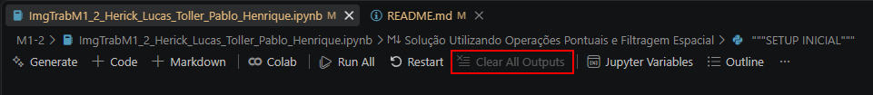
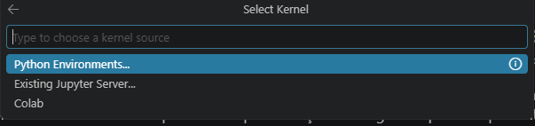
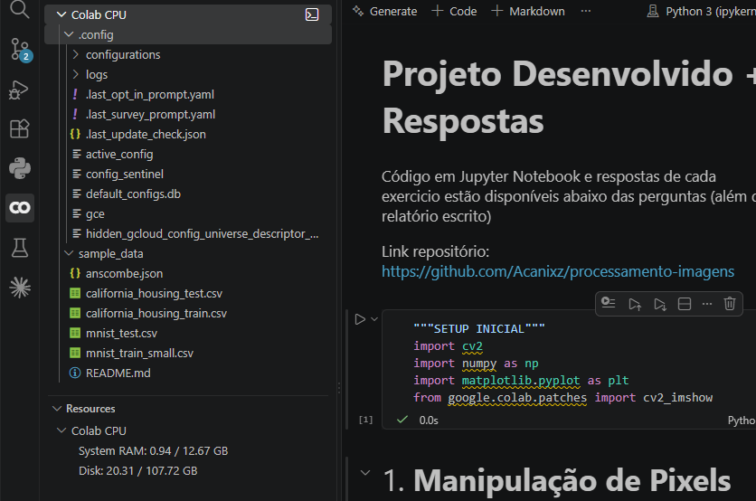
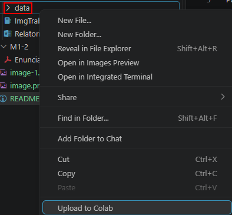

# Processamento de Imagens

Repositório dos trabalhos da disciplina de Processamento de Imagens. Cada trabalho fica em
sua própria pasta (ex: `M1-1/`, `M1-2/`), com o notebook (`.ipynb`) e a pasta `data/` com as
imagens usadas.

Para rodar os notebooks recomendamos o **VSCode conectado a um runtime do Google Colab**,
pois facilita o upload da pasta inteira (incluindo `data/`) para o ambiente, garantindo que
todos rodem com o **mesmo dataset**, nos **mesmos caminhos relativos**.

# IMPORTANTE
- **Antes de dar push nos arquivos ipynb, certifique de usar o botão ```Clear All Outputs``` para que o arquivo não estoure o limite de tamanho de 100MB!**
  - Caso isso aconteça, clone o repositorio novamente e mova os arquivos corrigidos para refazer a commit certa



## Pré-requisitos

- [VSCode](https://code.visualstudio.com/) instalado
- Conta Google (para autenticar no Colab)
- Este repositório clonado localmente (`git clone ...`)

## Passo a passo

### 1. Instale as extensões necessárias

- [Jupyter](https://marketplace.visualstudio.com/items?itemName=ms-toolsai.jupyter) (oficial, da Microsoft)

### 2. Abra o repositório no VSCode

Abra a pasta raiz do repositório (não só a subpasta do trabalho), para que os caminhos
relativos `data/...` usados no código funcionem corretamente.

### 3. Abra o notebook do trabalho

Ex: `M1-1/ImgTrabM1_Herick_Bittencourt_Luiz_Inthurn.ipynb`

### 4. Conecte ao runtime do Colab

Clique para rodar a primeira célula (preferencialmente só o setup inicial) e escolha as
opções na ordem:

**Colab -> AutoConnect (faça login com a conta Google) -> Python Kernel**



Se feito corretamente, o código roda com sucesso e a máquina fica disponível na aba do Colab
à esquerda:



### 5. Envie a pasta do trabalho para o Colab

Com o kernel do Colab conectado, clique com o botão direito na pasta do trabalho (ex:
`M1-1/`, que já contém a subpasta `data/`) no explorador de arquivos do VSCode e selecione
**"Upload to Colab"**.



Isso envia a pasta inteira (notebook + `data/`) para `/content/` na máquina do Colab, de
forma que os caminhos relativos usados no notebook resolvam corretamente, independente de
quem esteja rodando o código.

## Convenções importantes (para não quebrar entre colegas)

- **Sempre use caminhos relativos** (`data/...`) para carregar imagens no código — nunca
  caminhos absolutos do Colab (`/content/...`) nem caminhos locais da sua máquina.
- **Sempre use as imagens da pasta `data/`** do trabalho — nunca substitua por uma imagem
  própria só para testar, pois isso pode quebrar o notebook para os colegas.
- Rode o notebook **do início ao fim, em ordem** (top-to-bottom) antes de considerar pronto,
  para garantir que ele executa de forma limpa em outra máquina.
- Se o upload falhar ou os arquivos não aparecerem em `/content/`, reconecte o kernel (passo
  4) e repita o upload — não edite os caminhos do notebook para contornar o problema.
- Se algo der errado e você precisar recomeçar do zero, desconecte a máquina do Colab: com o
  notebook aberto, clique nos **3 pontinhos (⋯)** no canto superior direito do editor e
  selecione **Colab -> Remove Server** (ou **Reset**, se a opção disponível for essa).
  Depois, repita o passo 4 para conectar em um runtime novo.

# Importante!
- É normal que apareça erros sobre bibliotecas faltando, considerando que o intellisense está vendo o código como se fosse a SUA maquina, e não da maquina do colab, só foca em resolver os erros que aparecerem ao executar os blocos de código.